# Usando Pfsense como Concentrador de Redes na AWS

- [1) Porque usar Pfsense como concentrador?](#1-porque-usar-pfsense-como-concentrador)
- [2) Qual cenário vamos abordar?](#2-qual-cenário-vamos-abordar)  
- [3) VPCs](#3-vpcs)
  - [3.1) Primeira VPC](#31-primeira-vpc)
    - [3.1.1) Criando VPC](#311-criando-vpc)
    - [3.1.2) Criando SubNet](#312-criando-subnet)
    - [3.1.3) Criando Intenet Gateway](#313-criando-intenet-gateway) 
    - [3.1.4) Tabela de Roteamento](#314-tabela-de-roteamento)   
  - [3.2) Segunda VPC](#31-primeira-vpc)
    - [3.2.1) Criando VPC](#321-criando-vpc)
    - [3.2.2) Criando SubNet](#322-criando-subnet)
    - [3.2.3) Criando Intenet Gateway](#323-criando-intenet-gateway) 
    - [3.2.4) Tabela de Roteamento](#324-tabela-de-roteamento)
- [4) EC2 PfSense ](#4-ec2-pfsense)
    - [4.1) Criando EC2](#41-criando-ec2)
    - [4.2) Conectando na Instância](#42-conectando-na-instância)
    - [4.3) Adicionando Usuário Admin](#43-adicionando-usuário-admin)
    - [4.4) Configurações Básicas](#44-configurações-básicas)
    - [4.5) Certificado Web Browser](#45-certificado-web-browser)
    - [4.5) Certificado Web Browser](#45-certificado-web-browser)
    - [4.6) Adicionando Interface de Rede](#46-adicionando-interface-de-rede)
    - [4.7) Desabilitando Firewall](#47-desabilitando-firewall)
    - [4.8) Adicionando Ip Estático na EC2](#48-adicionando-ip-estático-na-ec2)
- [5) OpenVPN](#5-openvpn)
    - [5.1) Criando uma CA](#51-criando-uma-ca)
    - [5.2) Criando uma Certificado](#52-criando-um-certificado)
    - [5.3) Criando para Usuário](#53-certificado-para-usuario)
    - [5.4) Instalação de Pacotes](#54-instalação-de-pacotes)
        - [5.4.1) FreeRadios](#541-freeradios)
        - [5.4.2) OpenVPN Exporter](#542-openvpn-exporter)
    - [5.5) FreeRadios Configurações](#55-freeradios-configurações)
        - [5.5.1) Interfaces](#551-interfaces)
        - [5.5.2) Nas Clients](#552-nas-clients)
        - [5.5.2) Usuário FreeRadios](#552-usuário-freeradios)    
    - [5.6) OpenVPN Wizard](#56-openvpn-wizard)
    - [5.7) Adicionando Usuário de VPN](#57-adicionando-usuário-de-vpn)
    - [5.8) Exportando Configuração do Cliente](#58-exportando-configuração-do-cliente)
    - [5.9) VPN Connect](#59-vpn-connect)
- [6) IPSec](#6-ipsec)
    - [6.1) IPSec Wizard](#61-ipsec-wizard)
        - [6.1.1) Permissões AWS Necessárias](#611-permissões-aws-necessárias)
        - [6.1.2) Pacotes Pfsense Necessários](#612-pacotes-pfsense-necessários)
        - [6.1.3) Fechando Túnel](#613-fechando-tunel)
    - [6.2) IPSec Manualmente](#62-ipsec-manualmente)
        - [6.2.1) Fechando com Primeiro IP Público](#621-fechando-com-primeiro-ip-público)
            - [6.2.1.1) Fase 1](#6211-fase-1)
            - [6.2.1.1) Fase 2](#6211-fase-2)
        - [6.2.2) Fechando com Segundo IP Público](#622-fechando-com-segundo-ip-público)
            - [6.2.2.1) Fase 1](#6221-fase-1)
            - [6.2.2.1) Fase 2](#6221-fase-2)
    - [6.3) Fechando Conexão com Primeiro IP Público](#63-fechando-conexão-com-primeiro-ip-público)
    - [6.4) Fechando Conexão com Segundo IP Público](#63-fechando-conexão-com-segundo-ip-público)        

## 1) Porque usar Pfsense como concentrador?

A própria **AWS** forcesse um serviço de Túnel VPN entre as VPC, porém isso é cobrado. O objetivo é utilizar o **pfSense** para interligar as redes VPC.

## 2) Qual cenário vamos abordar?

Teremos **2 VPC** na mesma região, cada qual com sua respectiva faixa de IP. O desenho abaixo ilustrará melhor o papel do Pfsense.

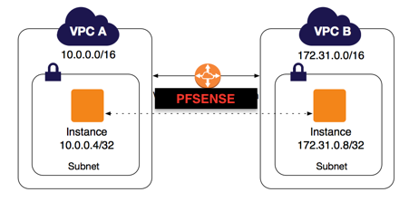

## 3) VPCs

### 3.1) Primeira VPC

Vamos criar nossa **Primeira VPC**. Observer que não temos nenhuma VPC associada nessa conta.

#### 3.1.1) Criando VPC

Os passos abaixos irá criar uma **Nova VPC**, a faixa de Rede usada será: **10.170.0.0/16**

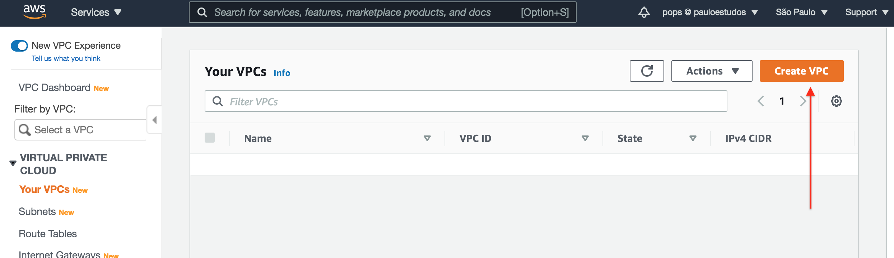

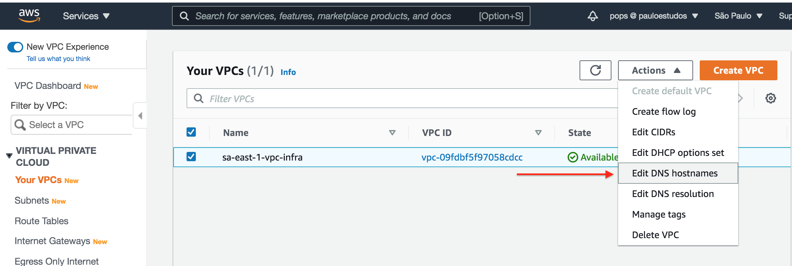

Habilitando essa flag, fará com que as EC2 criadas nessa VPC já tenham os nomes das instâncias associadas ao DNS da AWS.

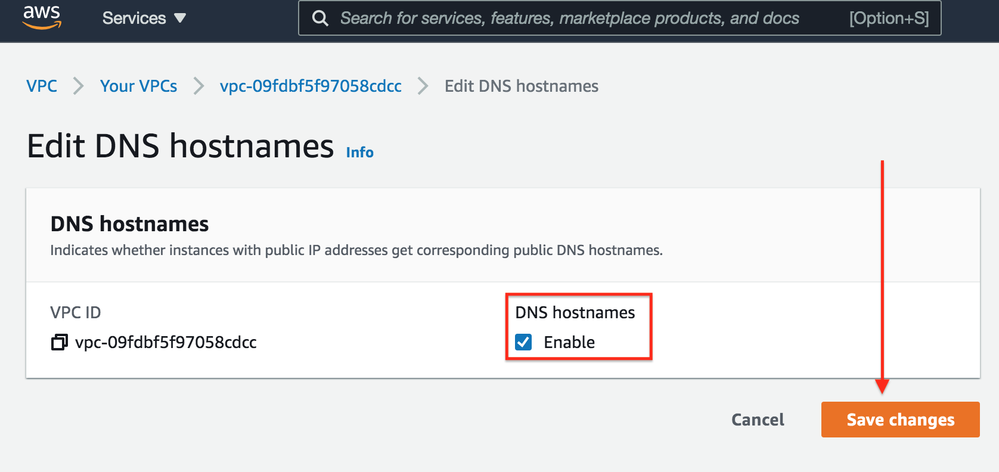

#### 3.1.2) Criando SubNet

Localize o menu **Subnet**, e clique no menu **Create subnet**, conforme mostra na imagem abaixo.

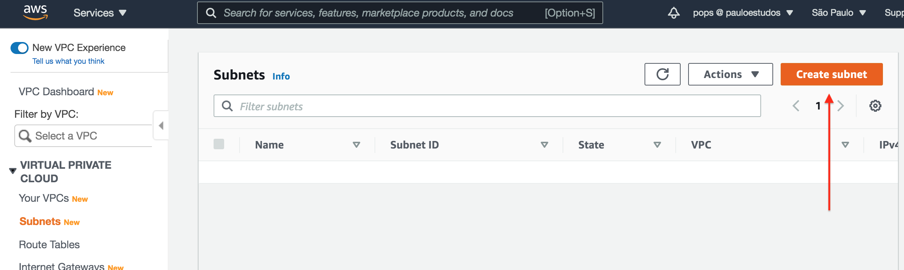

Escolha qual VPC irá associar a essa subnet.

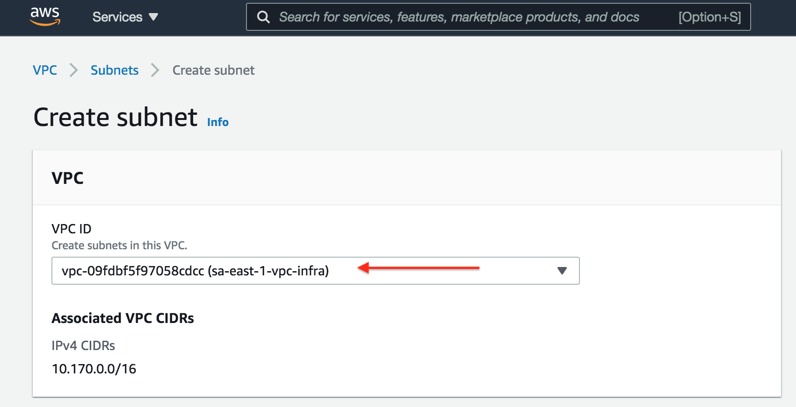

Um detalhe importante é que podemos criar várias subnets dentro de uma VPC, para esse material iremos criar uma Subnet na classe C, ou seja, a subnet terá o seguinte endereço de rede: **10.170.1.0/24**

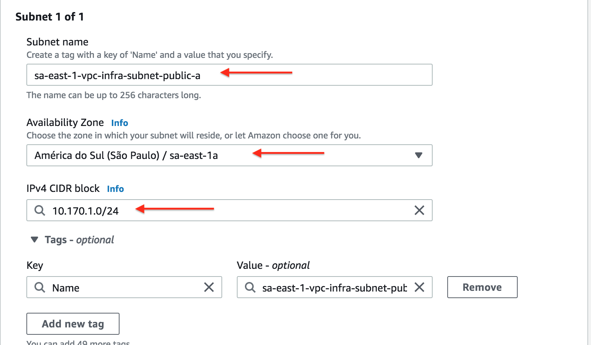

Para que uma **EC2** possa ter um serviço acessado **externamente**, ou seja, que outras pessoas possam acessar o conteúdo dessa **EC2** é necessário que ela tenha um **IP Público** vinculado a essa **EC2**, quando habilitado essa flag dentro da subnet, em outras palavras, vc está permitindo que essa **EC2** vinculada a essa Subnet possa ser acessada externamente por um **IP Publico**.

**Obs.:** Caso queira criar uma **Subnet apenas com acesso interno**, basta *NÃO* habilitar o recurso abaixo. 

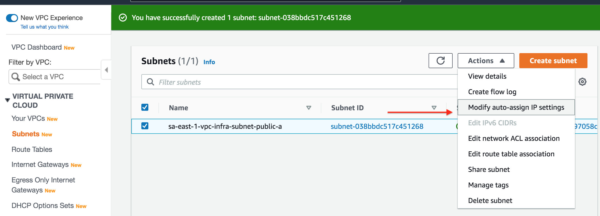

#### 3.1.3) Criando Intenet Gateway

No menu localize **Internet Gateway**, e clique em **Create internet gateway**.

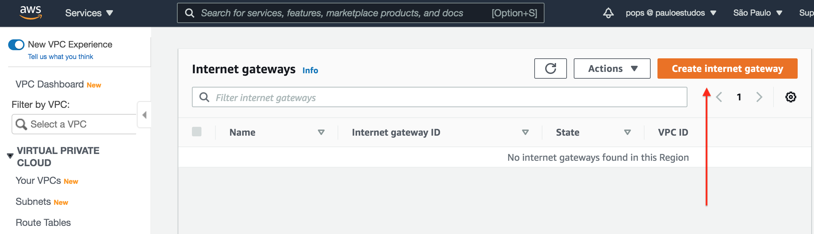

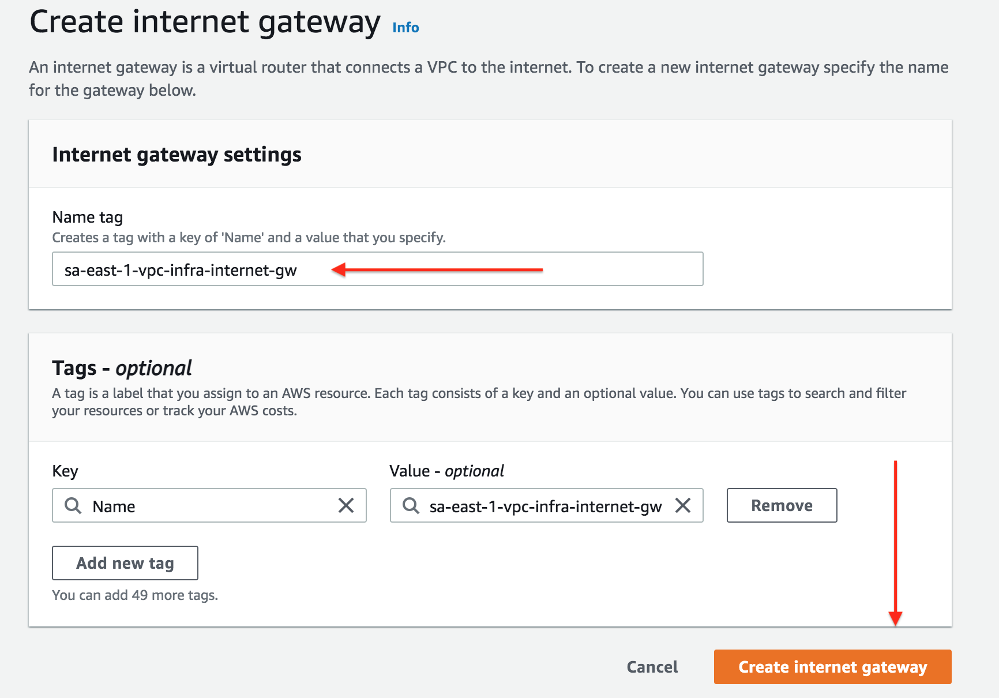

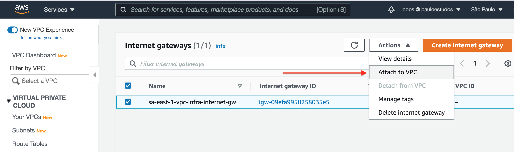

Após criado deve-se attachar qual VPC estará vinculada a esse internet gateway.

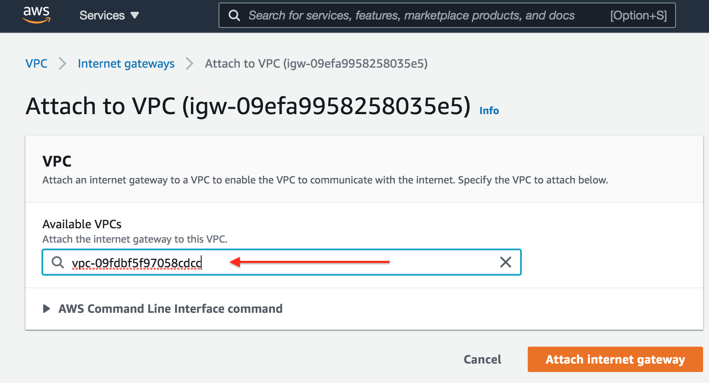

#### 3.1.4) Tabela de Roteamento   

É aqui que vamos definir se a subnet pode acessar a Internet, devemos criar uma rota default apontando para o gateway de internet criado no passo anterior.

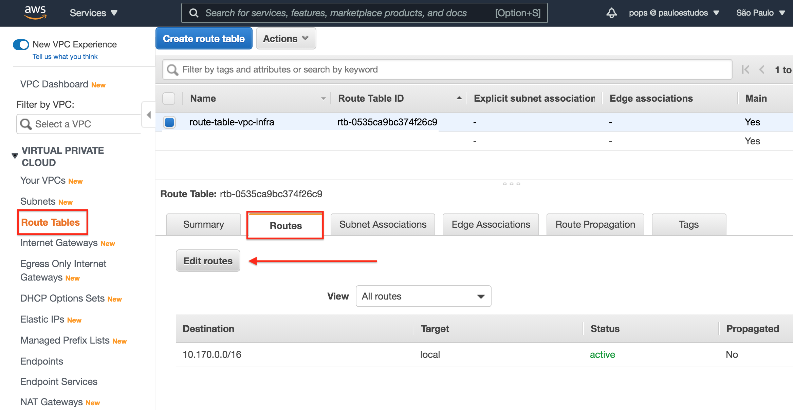

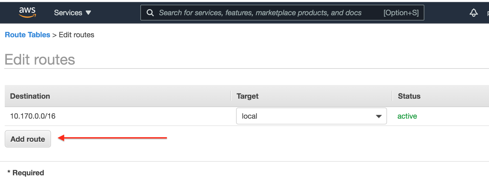

Adiconando a rota default para internet.

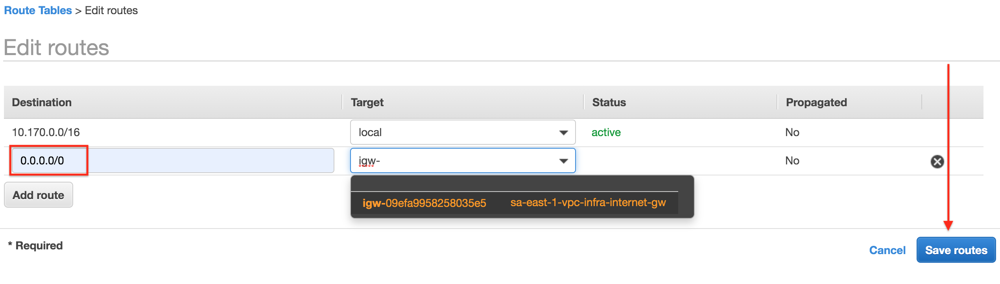

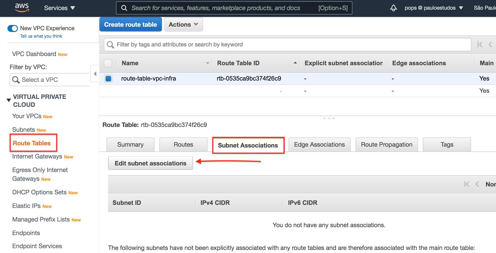

Por fim precisamos associar qual subnet essa configuração de rota irá aplicar-se.

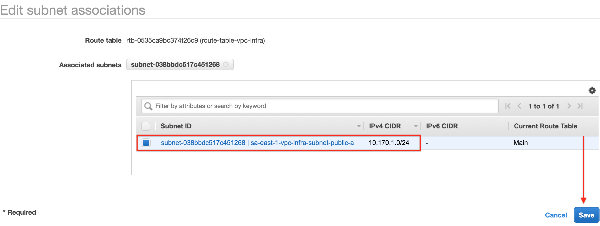
