# Criando SnapShot / Restaurando SnapShot em uma Imagem

- [1) Backup](#1-backup)
  - [1.1) Criando SnapShot](#11-criando-snapshot)
  - [1.2) Criando Imagem](#12-criando-imagem)
- [2) Restore ](#2-restore)
  - [2.1) Criando EC2 a partir de uma Imagem](#21-criando-ec2-a-partir-de-uma-imagem)
- [3) Destruindo Artefatos](#3-destruindo-artefatos)
  - [3.1) Excluindo Imagem](#31-excluindo-imagem)
  - [3.2) Excluindo SnapShot](#32-excluindo-snapshot)

## 1) Backup

  Esse serviço da AWS permite que você clone uma *Instância EC2*, e restaure esse clone em outra *Instância*. Esse processo pode ser feito na quente, ou seja, com a máquina ligada. 

#### 1.1) Criando SnapShot

Busque no menu da AWS por *EC2*, localize a sua instância que deseja realizar um *SnapShot*.

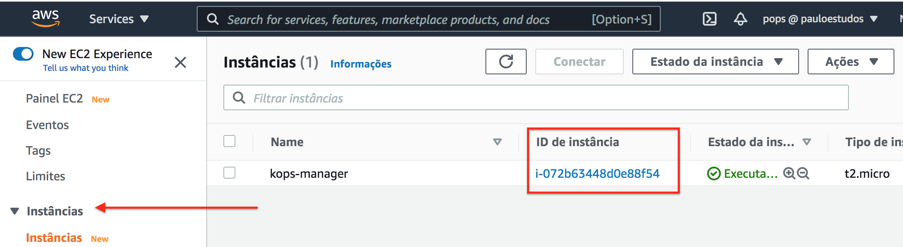

Localize qual dispositivo de bloco está associado a esta *Instância*.

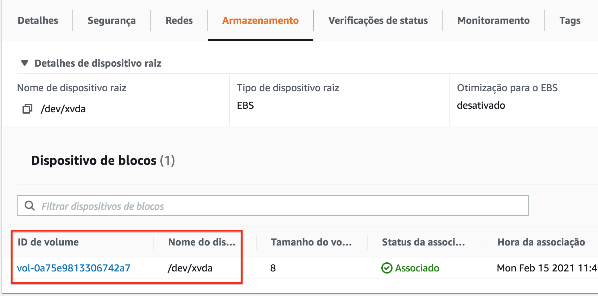

Ao ser redirecionado para a tela de gerenciamento de Volumes, crie um *SnapShot*.

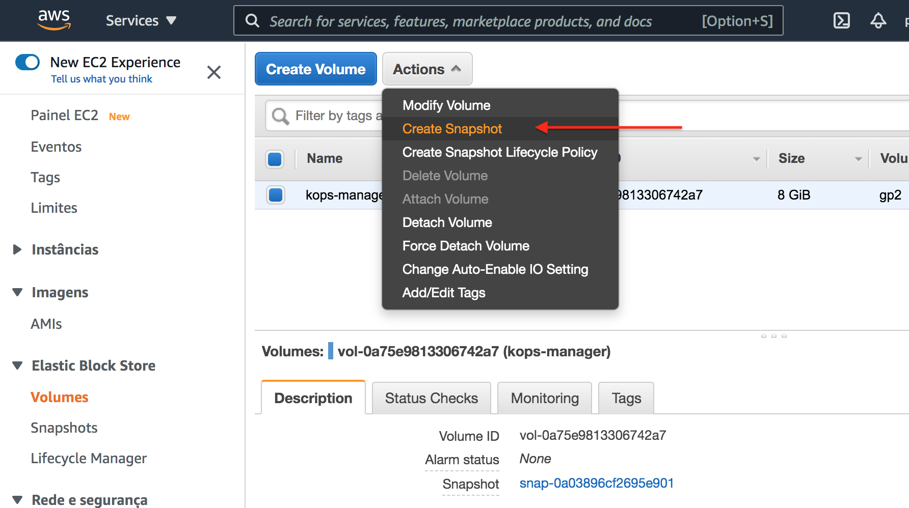
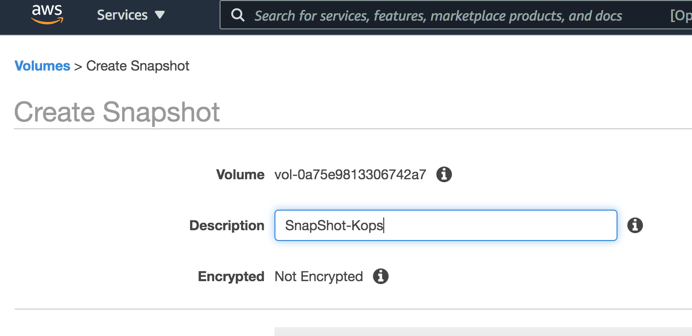
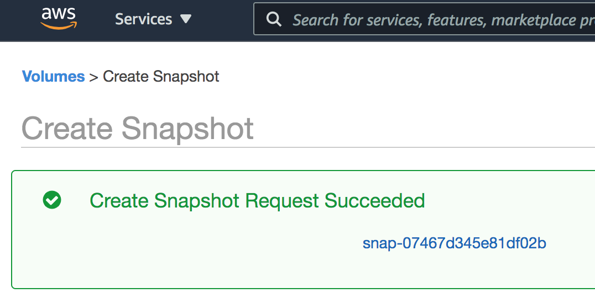

#### 1.2) Criando Imagem

No menu localize *SnapShots*, selecione o snapshot recém criado e crie uma Imagem.

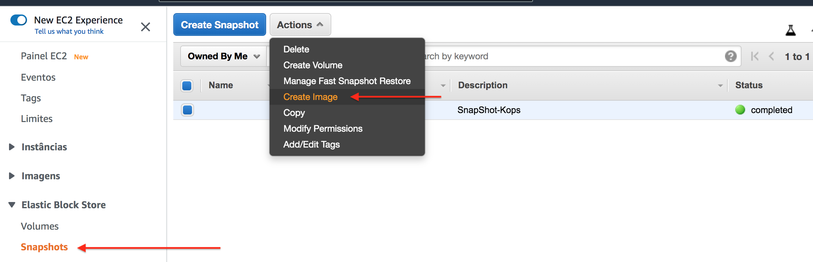
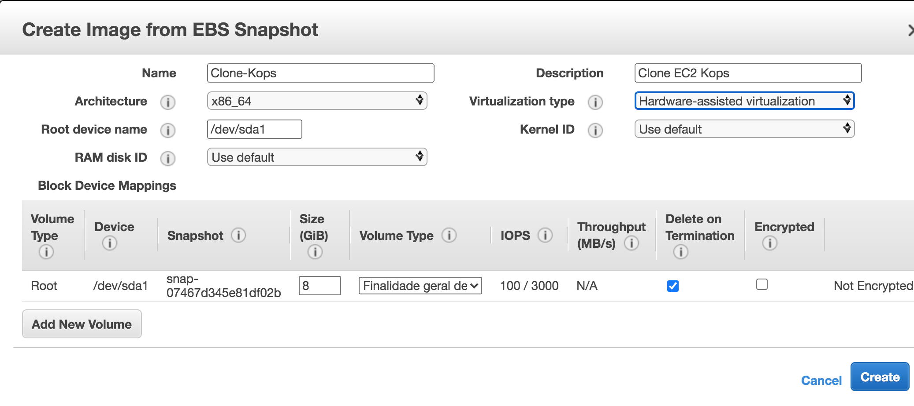

No menu localize *Imagens* => *AMIs*

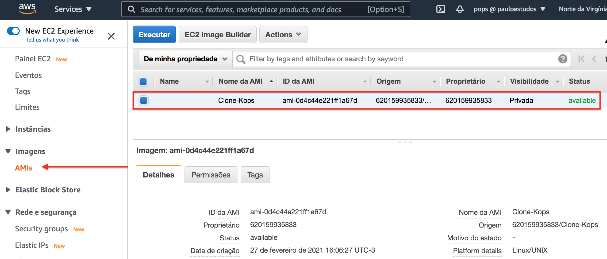

## 2) Restore 

O processo de restore é bem simples e você pode executa-lo em várias telas diferentes.
Ex:

Caso queira restaurar a partir do menu *Imagens* => *AMIs*

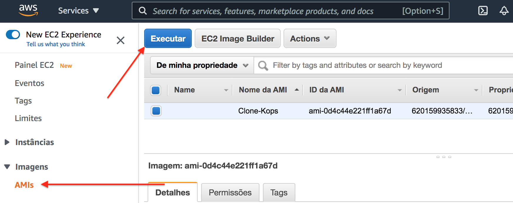

#### 2.1) Criando EC2 a partir de uma Imagem

Na tela de gerenciamento das *Instâncias EC2*, crie uma nova Instância.

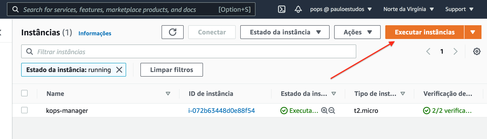

Localize o menu *Minhas AMIs*

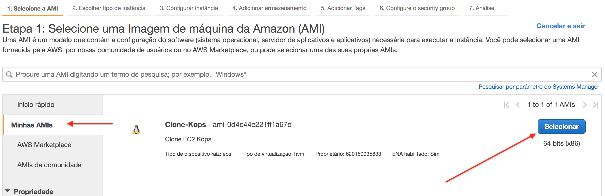
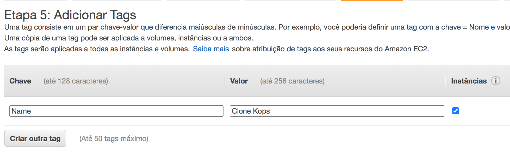

Escolha a chave para acesso SSH

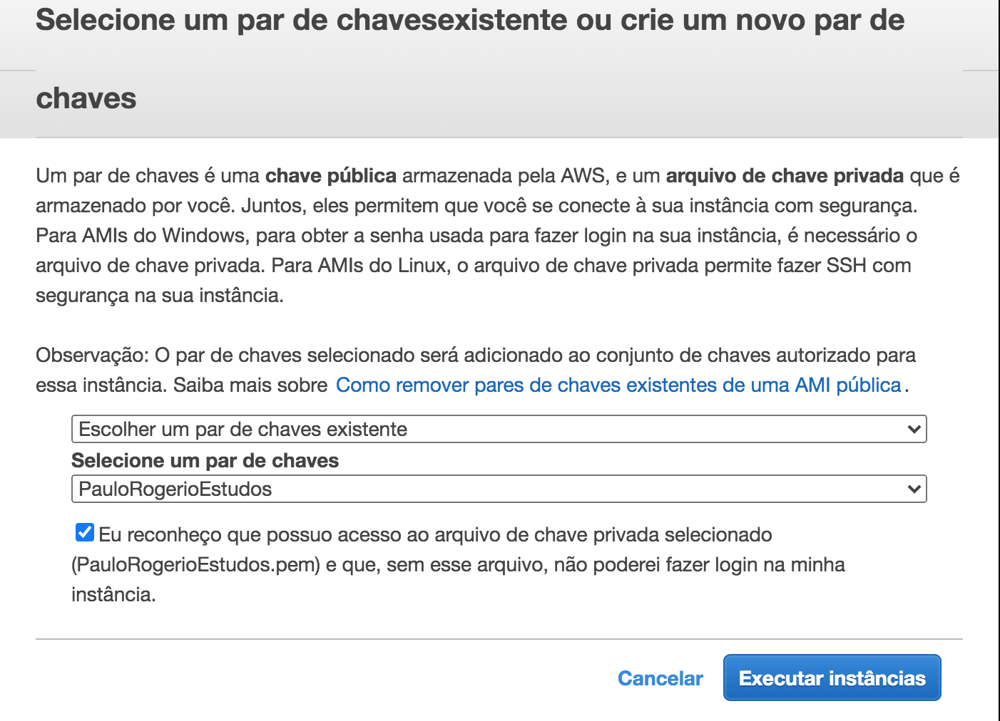

Aguarde até que a *Instância* esteja pronta.

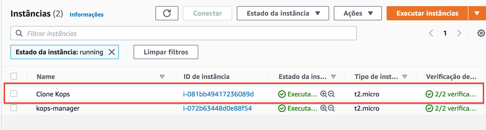

## 3) Destruindo Artefatos

Para evitar de manter essa imagens na AWS gerando custos desnecessário, e interassante que você remova essa *Imagem*, após o restore.

#### 3.1) Excluindo Imagem

No menu localize *Imagens* => *AMIs*, em *Actions* clique em *Cancelar Registro*.

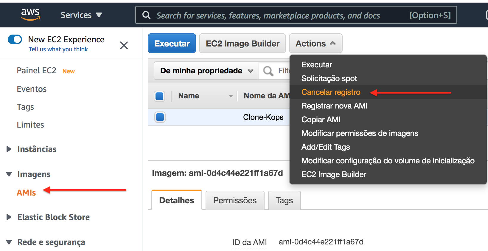

#### 3.2) Excluindo SnapShot

No menu localize *Elastic Block Store* => *SnapShot*, em *Actions* clique em *Delete*.

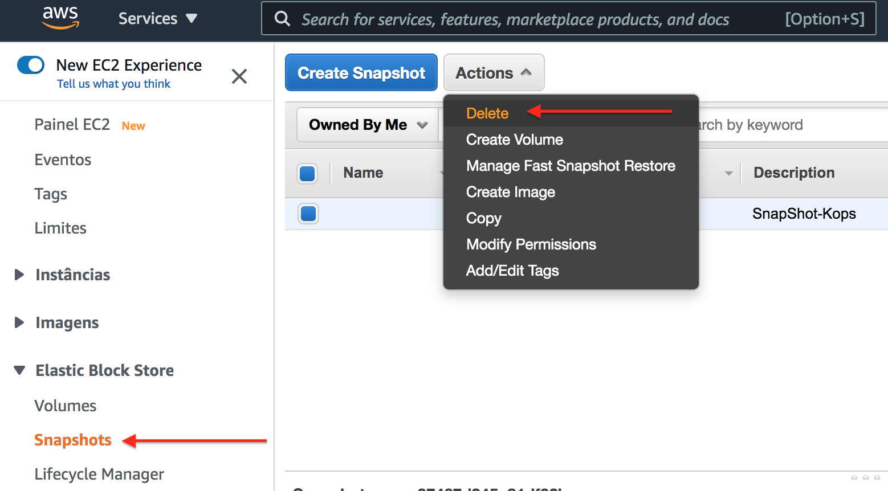