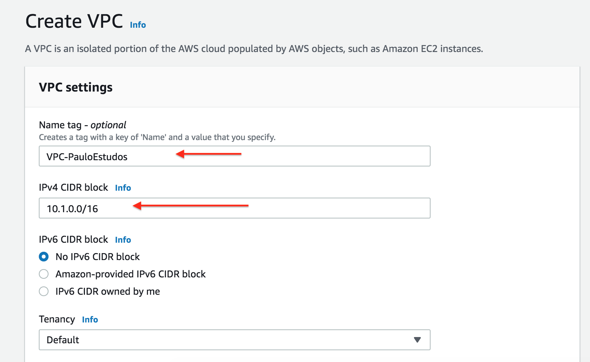

# Criando Minha VPC

- [1) O que é VPC?](#1-o-que-é-vpc)
  - [1.1) Como é criado uma VPC?](#11-como-é-criado-uma-vpc)
- [2) Qual cenário vamos abordar?](#2-qual-cenário-vamos-abordar)  
- [3) O que preciso saber antes?](#3-o-que-preciso-saber-antes)
  - [3.1) Calculando quantidade de endereços IPs](#31-calculando-quantidade-de-endereços-ips)
- [4) VPC](#4-vpc)
  - [4.1) Criando Minha VPC](#41-criando-minha-vpc)

## 1) O que é VPC?

Virtual é nuvem privada virtual, configurável de recursos compartilhados de computação alocados dentro de um ambiente de nuvem pública, fornecendo um certo nível de isolamento entre as diferentes organizações, utilizando os recursos da AWS

### 1.1) Como é criado uma VPC?

A Própria *AWS* pode criar automaticamente um VPC no formato *default*, mas na grande maioria dos cenários encontrados há uma necessidade de fazer esse processo manualmente. E é isso que essa documentação se compromete a passar.

## 2) Qual cenário vamos abordar?

Teremos 2 VPC, sendo que uma terá multiplas sub-redes e essas VPC se comunicarão.


## 3) O que preciso saber antes?

### 3.1) Calculando quantidade de endereços IPs

Nessa etapa deve-se atentar em alguns detalhes, principalmete no que diz respeito a quantidade de **Host** que essa VPC irá suportar. O que preciso saber?

Para montarmos uma Rede IPV4 precisamos usar alguns endereços contidos nas classes A, B ou C que respectivamente apontam para:

```yaml
Classe A    10.0.0.0   – 10.255.255.255
Classe B    172.16.0.0 – 172.31.255.255
Classe C    192.168.0.0 – 192.168.255.255
```
Nesse cenário escolhemos que a *VPC* terá uma rede no seguinte formato: **10.1.0.0/16**
Isso nos permitirá criarmos até **65.536 hosts**

#### Entendo como é feito os calculos

```yaml
Rede: 10.1.0.0/255.255.0.0
```

A mascara é formada por octetos, ou seja, uma mascara de rede contém até 32 bits, dividos em 4 blocos.

```yaml
    1º octeto   |   2º octeto     |  3º octeto      |    4º octeto
-----------------------------------------------------------------------
_._._._._._._._ | _._._._._._._._ | _._._._._._._._ | _._._._._._._._ 
``` 

Cada bit é representado por **0** ou **1**, sendo assim uma mascara no formato: *255.255.0.0* tem o seguinte escrita binária.

```yaml
1.1.1.1.1.1.1.1 | 1.1.1.1.1.1.1.1 | 0.0.0.0.0.0.0 | 0.0.0.0.0.0.0 
```

Sendo que o *BITS REPRESENTADOS POR* **0**, são definidos como *HOSTS*.

#### Como calcular a quantidade de Hosts?

A Conta é bem simples: **2 ( elevado a quantidade de NUMEROS 0 ) - 2**

Porque - 2? Porque um dos endereço é destinado **ENDEREÇO DE REDE** e outro **GATEWAY DA REDE**. Sendo assim temos o seguinte resultado.

2<sup>16</sup> -2 = **65.536 hosts**

## 4) VPC

Nesse cenário estou presumindo que não temos nenhuma VPC, Sub-Net, Intenet Gateway, pois iremos criar isso manualmente. Obsever que não possuimos nada criado.

## 4.1) Criando Minha VPC


Click em *Create VPC*, conforme mostra a imagem abaixo 


Defina o enderaçamento IP que será utililzado.



#### Definindo que as EC2 serão resolvidas pelo DNS da AWS (ec2.intenal)


#### Resumo do que foi instalado até o momento

