# Cluster Kubernetes AWS 

  - [1) Preparando Host Compartilhado](#1-preparando-host-compartilhado)
    - [1.1) Instância EC2 com Kops](#11-inst%C3%A2ncia-ec2-com-kops)
    - [1.2) Previlégios Necessários](#12-previl%C3%A9gios-necess%C3%A1rios)
    - [1.3) Criando Roles](#13-criando-roles)
    - [1.4) Instalando AWS Client](#14-instalando-aws-client)
    - [1.5) Instalando Kubectl](#15-instalando-kubectl)
    - [1.6) Instalando Kops](#16-instalando-kops)
    - [1.7) Par de Chaves](#17-par-de-chaves)            
  - [2) Route53](#2-route53)
    - [2.1) DNS Sub-Domínios](#21-dns-sub-dom%C3%ADnios)
    - [2.2) Configurar DNS](#22-configurar-dns)                  
  - [3) Buckets S3](#3-buckets-s3)
    - [3.1) Criando um Bucket](#31-criando-um-bucket) 
  - [4) Kops Provisionando Cluster](#4-kops-provisionando-cluster)
    - [4.1) Criando Cluster](#41-criando-cluster)
    - [4.2) Validando Cluster](#42-criando-cluster)
    - [4.3) Primeiro Deployment](#43-primeiro-deployment)
    - [4.4) LoadBalancer Acesso Externo](#44-loadbalancer-acesso-externo)
  - [5) Manipulando Orquestrador](#5-manipulando-orquestrador)
    - [5.1) Aumentando Quantidade de Workers](#5.1-aumentando-quantidade-de-workers)

## 1) Preparando Host Compartilhado

  Nesse documento estarei assumindo que teremos uma máquina dentro da **AWS** compartilhada, essa máquina será a responsável por gerenciar o **KOPS**. Isso nos permitirá um controle mais granular de quem realmente manipulará o kops.

### 1.1) Instância EC2 com Kops
  
  Essa máquina compartilhada é apenas um provisionador, não há necessidade dessa instância EC2 ter um hardware performático. Nessa documentação foi utilizado as seguintes configurações:

```ruby
tipo: t2.micro 
s.o : awslinux
cpu : 1
mem : 1
```

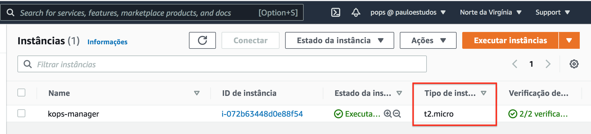

### 1.2) Previlégios Necessários

  Para que o kops possa interagir com os serviços da **AWS**, será necessário conceder previlégios. Nada impede de possuir uma conta de usuário *IAM* e especificar dentro da máquina **KOPS** as credencias necessárias ( **AWS Access Key ID** / **AWS Secret Access Key** ).
  
  Nessa documentação iremos adotar uma outra abordagem, vamos criar uma **ROLE** e anexar essa role na instância.

### 1.3) Criando Roles

  No painel esquerdo localize o menu **Funções**

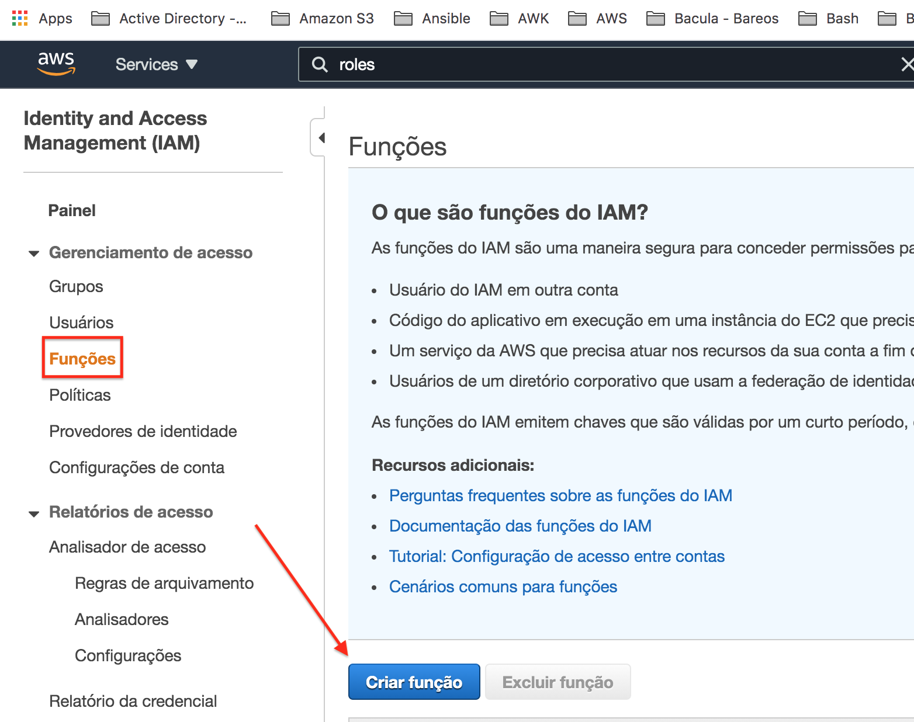

  Selecione a opção EC2

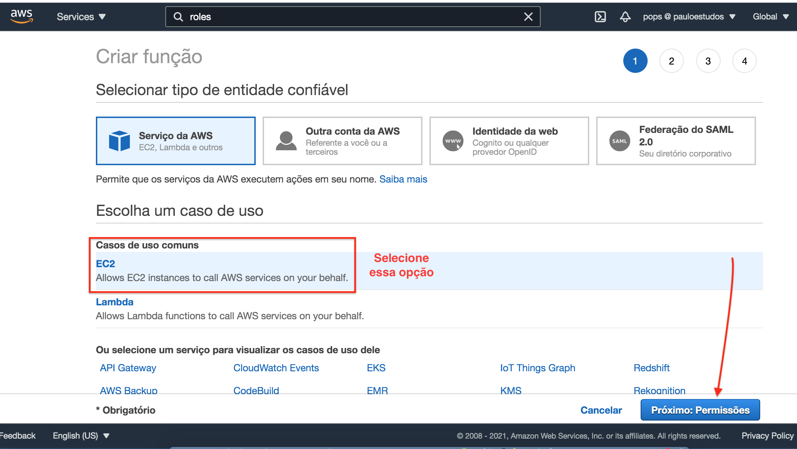

  Aplique todas as permissões abaixo na Role.

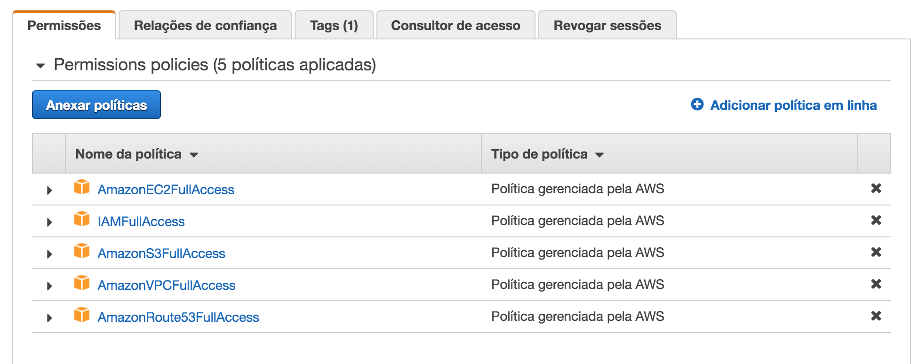

  No menu de buscas, localize sua instâncias, mais precisamente a **EC2** que está rodando o **kops-manager**. Após localiza-la, vamos atribui-la a essa função recém criada.

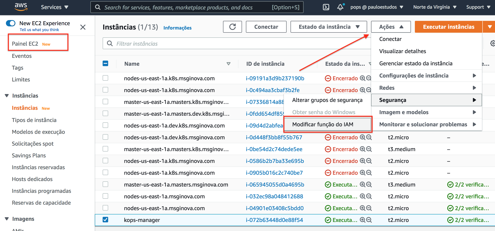

  Vincule as permissões recém criadas na instância desejada.

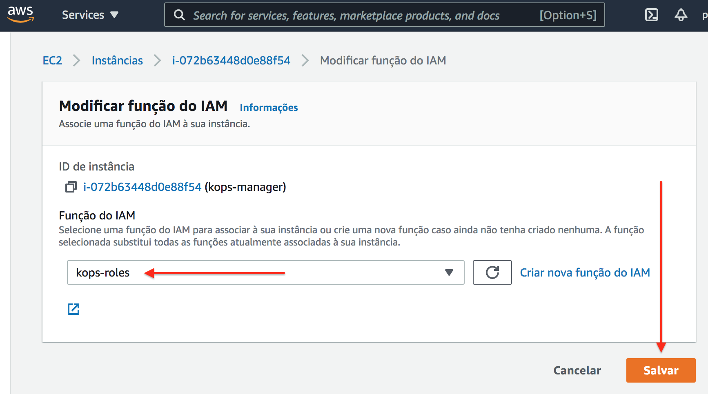

### 1.4) Instalando AWS Client

  Conecte na instância via SSH para podermos prepara-la. Após conectar vire root.

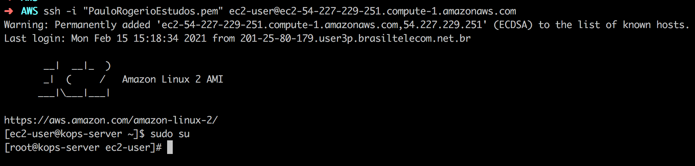

```bash
[root@kops-server ~]# mkdir -p /opt/sources
[root@kops-server ~]# curl -fsSL -o /opt/sources/awscli-bundle.zip https://s3.amazonaws.com/aws-cli/awscli-bundle.zip
[root@kops-server ~]# yum update && yum install unzip python -y
[root@kops-server ~]# cd /opt/sources && unzip -q awscli-bundle.zip && cd awscli-bundle && ./install -i /opt/apps/aws -b /opt/apps/aws/bin
[root@kops-server ~]#  echo "/opt/apps/aws/lib/python2.7" > /etc/ld.so.conf.d/aws.conf && ldconfig
[root@kops-server ~]# aws ls
```

Uma vez instalado, agora é necessário configurar a instância para interagir com AWS.

*OBS.:* Os campos **AWS Access Key ID** e **AWS Secret Access Key** não devem ser preenchido, pois já fizemos o vínculo em um passo anterior.

```bash
[root@kops-server ~]# aws configure
AWS Access Key ID [None]:
AWS Secret Access Key [None]:
Default region name [None]: us-east-1
Default output format [json]: json
```

### 1.5) Instalando Kubectl

```bash
[root@kops-server ~]# curl -fsSL -o /opt/sources/kubectl https://storage.googleapis.com/kubernetes-release/release/$(curl -s https://storage.googleapis.com/kubernetes-release/release/stable.txt)/bin/linux/amd64/kubectl
[root@kops-server ~]# chmod +x /opt/sources/kubectl
[root@kops-server ~]# mv /opt/sources/kubectl /usr/local/bin/kubectl
[root@kops-server ~]# echo "export PATH=$PATH:/usr/local/bin/" > /etc/profile.d/kubernets.sh && source /etc/profile
```

### 1.6) Instalando Kops

```bash
[root@kops-server ~]# curl -fsSL -o /opt/sources/kops-linux-amd64 https://github.com/kubernetes/kops/releases/download/$(curl -s https://api.github.com/repos/kubernetes/kops/releases/latest | grep tag_name | cut -d '"' -f 4)/kops-linux-amd64
[root@kops-server ~]# chmod +x /opt/sources/kops-linux-amd64
[root@kops-server ~]# mv /opt/sources/kops-linux-amd64 /usr/local/bin/kops
```
### 1.7) Par de Chaves

```bash
[root@kops-server ~]# ssh-keygen
Generating public/private rsa key pair.
Enter file in which to save the key (/root/.ssh/id_rsa):
Created directory '/root/.ssh'.
Enter passphrase (empty for no passphrase):
Enter same passphrase again:
Your identification has been saved in /root/.ssh/id_rsa.
Your public key has been saved in /root/.ssh/id_rsa.pub.
The key fingerprint is:
SHA256:UgIAhdy6IXxzddeh0WZCVU7YGPDxcMF797CiRY2Zi/RA root@kops-server
The key's randomart image is:
+---[RSA 2048]----+
|&@@OB.           |
|=OoE X           |
|..= @ * .        |
| o @ o =         |
|. = * = S        |
|   . + o         |
|    .            |
|                 |
|                 |
+----[SHA256]-----+
```

## 2) Route53 

  O kops é orientado por rotas baseado em nomes, por isso é interessante criar um domínio próprio antes de iniciar o cluster. A partir da versão 1.16 é possível criar um cluster usando um DNS genérico **k8s.local**.

  O melhor cenário é criar um **sub-domínio** para receber as entradas DNS. Nesse documento vou usar um domínio real chamado *msginova.com*. Não estarei usando sub-domínio pois até o momento da criação desse documento meu DNS estava sob-responsabilidade da Goddady.

  Para fazer uso do sub-domínio é necessário migrar o gerenciamento do *DNS* para *AWS*. 

### 2.1) DNS Sub-Domínios

  Uma vez que o sub-domino estiver configurado, o layout desejado seria esse:

```yaml
Dominio Principal    => msginova.com
Sub-Dominio-K8S      => k8s.msginova.com

Cluster Produção     => production.k8s.msginova.com
Cluster Staging      => staging.k8s.msginova.com
Cluster Homologacao  => homologacao.k8s.msginova.com
```

### 2.2) Configurar DNS

  Para o laboratório vamos usar um **DNS Vádido** *msginova.com*. No painel AWS busque por *Route53*, depois crie uma Zona do tipo *Público*.

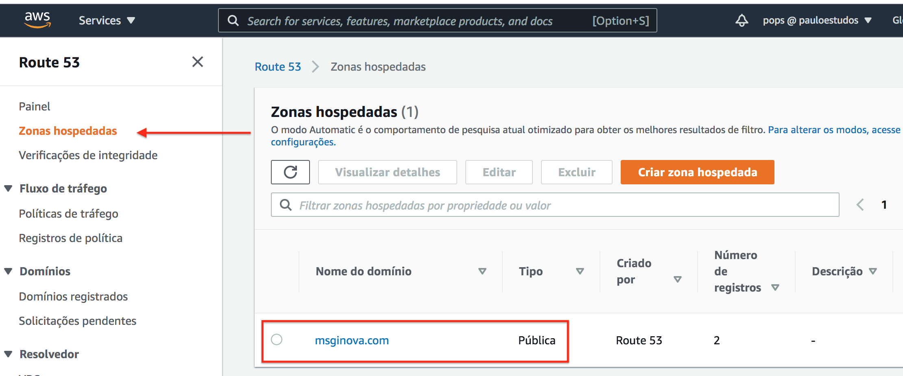  

 ## 3) Buckets S3

  Todas as configurações do cluster kubernetes gerenciado pelo kops ficam armazenados no *S3*, portanto devemos configurar esse serviço antes de iniciarmos os trabalhos com o kops.

### 3.1) Criando um Bucket

```bash
[root@kops-server ~]# export KOPS_STATE_STORE=s3://k8s-dev.msginova.com
[root@kops-server ~]# aws s3 mb $KOPS_STATE_STORE
```

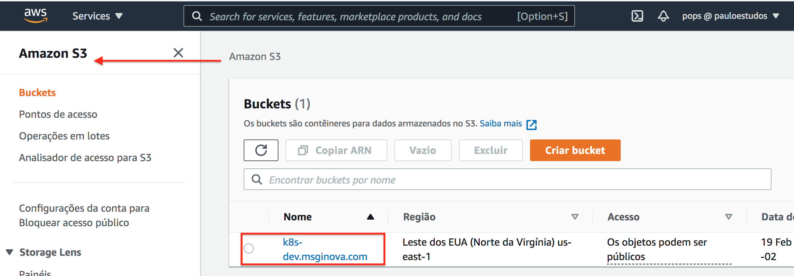

## 4) Kops Provisionando Cluster

  O kops aceita vários parâmetros na hora da criação do cluster. Os valores passados foi para atender a minha necessidade, como é um ambiente de estudos utilizei o mínimo de recursos necessários.

```yaml
  Zona AWS                        => us-east-1 ( Norte da Virgínia )
  EC2 Master                      => t3.medium
  EC2 Worker                      => t2.micro
  Quantidade de Instâncias Master => 1
  Quantidade de Instâncias Worker => 2 
```

### 4.1) Criando Cluster

```bash
[root@kops-server ~]# export NAME=msginova.com
[root@kops-server ~]# kops create cluster --name=$NAME --zones=us-east-1a --master-size t3.medium --node-size t2.micro --master-count 1 --node-count=2 --kubernetes-version 1.16.0
```

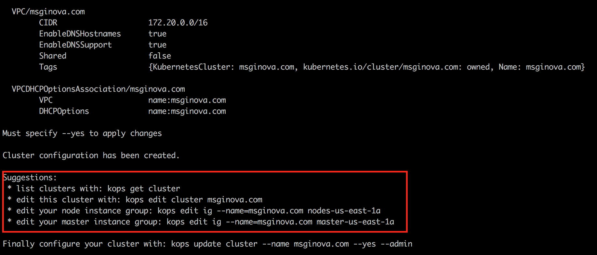

```bash
[root@kops-server ~]# kops create secret --name=$NAME sshpublickey admin -i ~/.ssh/id_rsa.pub
[root@kops-server ~]# kops update cluster $NAME --yes
```

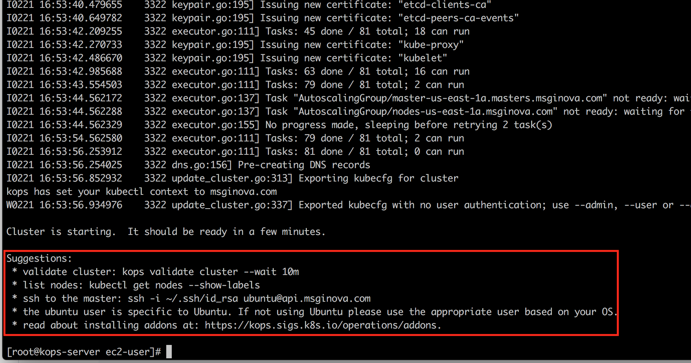

### 4.2) Validando Cluster

O processo de criação do cluster demora de 5 a 10 minutos, quando finalizar deve-se existir 3 novas instâncias EC2.

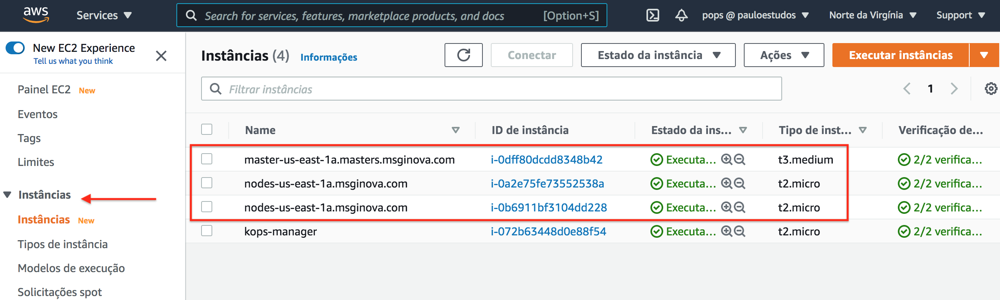

```bash
[root@kops-server ~]# kops get cluster
NAME		CLOUD	ZONES
msginova.com	aws	us-east-1a
```

```bash
[root@kops-server ~]# kops export kubecfg msginova.com --admin
kops has set your kubectl context to msginova.com
```

```bash
[root@kops-server ~]# kops validate cluster
```

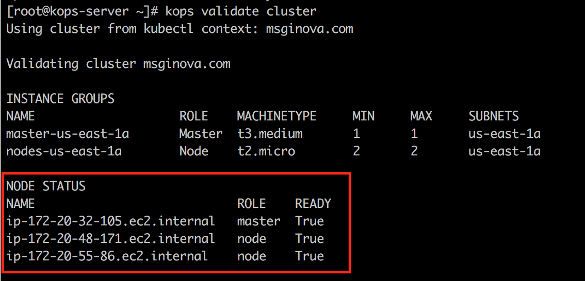

```bash
[root@kops-server ~]# kubectl get nodes
```

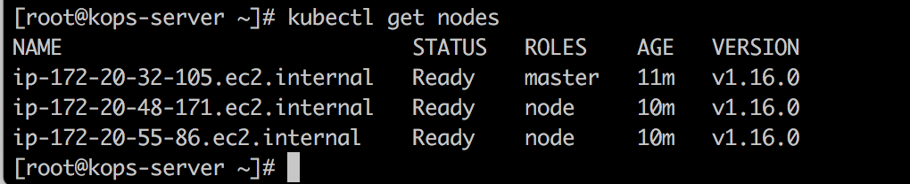

### 4.3) Primeiro Deployment

### 4.4) LoadBalancer Acesso Externo

## 5) Manipulando Orquestrador

### 5.1) Aumentando Quantidade de Workers
