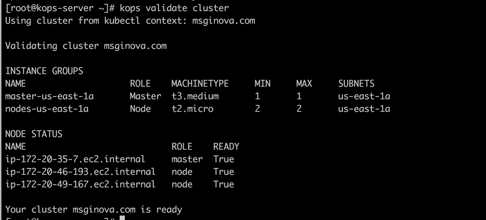
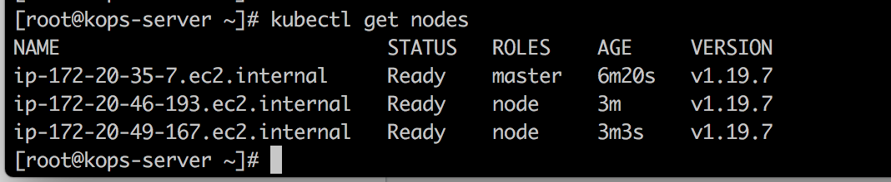
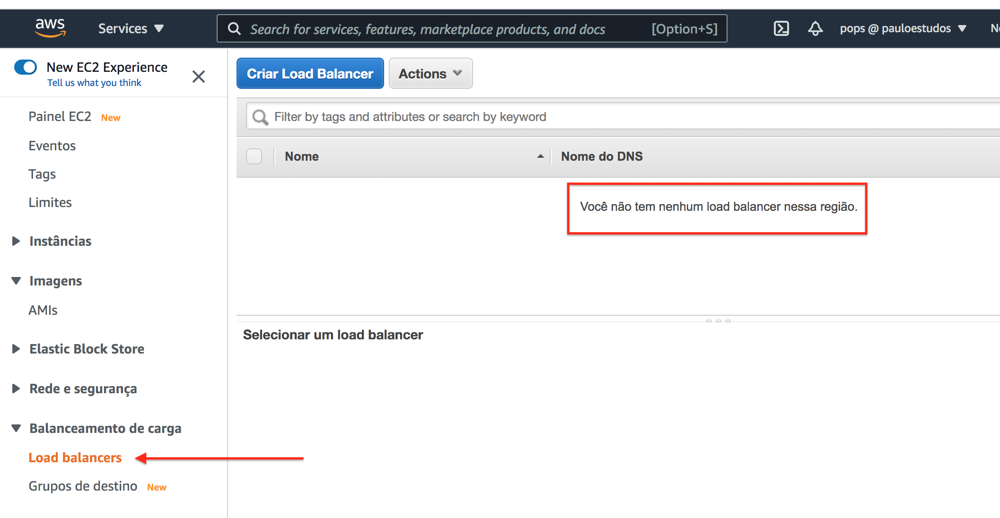
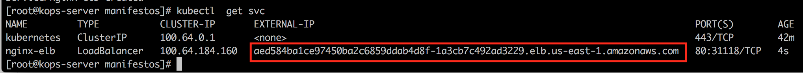
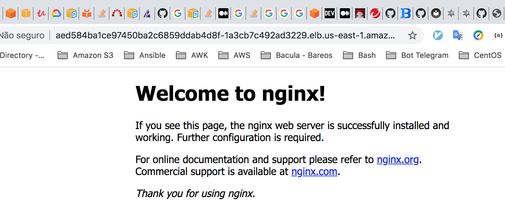
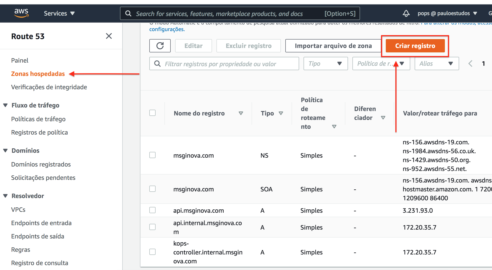
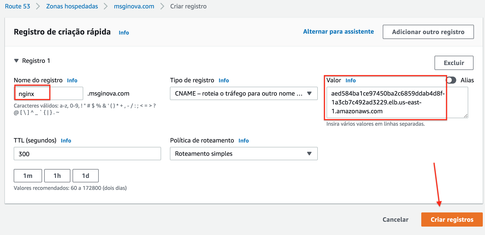

# Cluster Kubernetes AWS 

  - [1) Preparando Host Compartilhado](#1-preparando-host-compartilhado)
    - [1.1) Instância EC2 com Kops](#11-inst%C3%A2ncia-ec2-com-kops)
    - [1.2) Previlégios Necessários](#12-previl%C3%A9gios-necess%C3%A1rios)
    - [1.3) Criando Roles](#13-criando-roles)
    - [1.4) Instalando AWS Client](#14-instalando-aws-client)
    - [1.5) Instalando Kubectl](#15-instalando-kubectl)
    - [1.6) Instalando Kops](#16-instalando-kops)
    - [1.7) Par de Chaves](#17-par-de-chaves)            
  - [2) Route53](#2-route53)
    - [2.1) DNS Sub-Domínios](#21-dns-sub-dom%C3%ADnios)
    - [2.2) Configurar DNS](#22-configurar-dns)                  
  - [3) Buckets S3](#3-buckets-s3)
    - [3.1) Criando um Bucket](#31-criando-um-bucket) 
  - [4) Kops Provisionando Cluster](#4-kops-provisionando-cluster)
    - [4.1) Criando Cluster](#41-criando-cluster)
    - [4.2) Validando Cluster](#42-criando-cluster)
    - [4.3) Primeiro Deployment](#43-primeiro-deployment)
    - [4.4) LoadBalancer Acesso Externo](#44-loadbalancer-acesso-externo)
    - [4.5) DNS Amigável](#45-dns-amig%C3%A1vel)    
  - [5) Manipulando Orquestrador](#5-manipulando-orquestrador)
    - [5.1) Aumentando Quantidade de Workers](#5.1-aumentando-quantidade-de-workers)

## 1) Preparando Host Compartilhado

  Nesse documento estarei assumindo que teremos uma máquina dentro da **AWS** compartilhada, essa máquina será a responsável por gerenciar o **KOPS**. Isso nos permitirá um controle mais granular de quem realmente manipulará o kops.

### 1.1) Instância EC2 com Kops
  
  Essa máquina compartilhada é apenas um provisionador, não há necessidade dessa instância EC2 ter um hardware performático. Nessa documentação foi utilizado as seguintes configurações:

```ruby
tipo: t2.micro 
s.o : awslinux
cpu : 1
mem : 1
```


### 1.2) Previlégios Necessários

  Para que o kops possa interagir com os serviços da **AWS**, será necessário conceder previlégios. Nada impede de possuir uma conta de usuário *IAM* e especificar dentro da máquina **KOPS** as credencias necessárias ( **AWS Access Key ID** / **AWS Secret Access Key** ).
  
  Nessa documentação iremos adotar uma outra abordagem, vamos criar uma **ROLE** e anexar essa role na instância.

### 1.3) Criando Roles

  No painel esquerdo localize o menu **Funções**


  Selecione a opção EC2


  Aplique todas as permissões abaixo na Role.


  No menu de buscas, localize sua instâncias, mais precisamente a **EC2** que está rodando o **kops-manager**. Após localiza-la, vamos atribui-la a essa função recém criada.


  Vincule as permissões recém criadas na instância desejada.


### 1.4) Instalando AWS Client

  Conecte na instância via SSH para podermos prepara-la. Após conectar vire root.


```bash
[root@kops-server ~]# mkdir -p /opt/sources
[root@kops-server ~]# curl -fsSL -o /opt/sources/awscli-bundle.zip https://s3.amazonaws.com/aws-cli/awscli-bundle.zip
[root@kops-server ~]# yum update && yum install unzip python -y
[root@kops-server ~]# cd /opt/sources && unzip -q awscli-bundle.zip && cd awscli-bundle && ./install -i /opt/apps/aws -b /opt/apps/aws/bin
[root@kops-server ~]#  echo "/opt/apps/aws/lib/python2.7" > /etc/ld.so.conf.d/aws.conf && ldconfig
[root@kops-server ~]# aws ls
```

Uma vez instalado, agora é necessário configurar a instância para interagir com AWS.

*OBS.:* Os campos **AWS Access Key ID** e **AWS Secret Access Key** não devem ser preenchido, pois já fizemos o vínculo em um passo anterior.

```bash
[root@kops-server ~]# aws configure
AWS Access Key ID [None]:
AWS Secret Access Key [None]:
Default region name [None]: us-east-1
Default output format [json]: json
```

### 1.5) Instalando Kubectl

```bash
[root@kops-server ~]# curl -fsSL -o /opt/sources/kubectl https://storage.googleapis.com/kubernetes-release/release/$(curl -s https://storage.googleapis.com/kubernetes-release/release/stable.txt)/bin/linux/amd64/kubectl
[root@kops-server ~]# chmod +x /opt/sources/kubectl
[root@kops-server ~]# mv /opt/sources/kubectl /usr/local/bin/kubectl
[root@kops-server ~]# echo "export PATH=$PATH:/usr/local/bin/" > /etc/profile.d/kubernets.sh && source /etc/profile
```

### 1.6) Instalando Kops

```bash
[root@kops-server ~]# curl -fsSL -o /opt/sources/kops-linux-amd64 https://github.com/kubernetes/kops/releases/download/$(curl -s https://api.github.com/repos/kubernetes/kops/releases/latest | grep tag_name | cut -d '"' -f 4)/kops-linux-amd64
[root@kops-server ~]# chmod +x /opt/sources/kops-linux-amd64
[root@kops-server ~]# mv /opt/sources/kops-linux-amd64 /usr/local/bin/kops
```
### 1.7) Par de Chaves

```bash
[root@kops-server ~]# ssh-keygen
Generating public/private rsa key pair.
Enter file in which to save the key (/root/.ssh/id_rsa):
Created directory '/root/.ssh'.
Enter passphrase (empty for no passphrase):
Enter same passphrase again:
Your identification has been saved in /root/.ssh/id_rsa.
Your public key has been saved in /root/.ssh/id_rsa.pub.
The key fingerprint is:
SHA256:UgIAhdy6IXxzddeh0WZCVU7YGPDxcMF797CiRY2Zi/RA root@kops-server
The key's randomart image is:
+---[RSA 2048]----+
|&@@OB.           |
|=OoE X           |
|..= @ * .        |
| o @ o =         |
|. = * = S        |
|   . + o         |
|    .            |
|                 |
|                 |
+----[SHA256]-----+
```

## 2) Route53 

  O kops é orientado por rotas baseado em nomes, por isso é interessante criar um domínio próprio antes de iniciar o cluster. A partir da versão 1.16 é possível criar um cluster usando um DNS genérico **k8s.local**.

  O melhor cenário é criar um **sub-domínio** para receber as entradas DNS. Nesse documento vou usar um domínio real chamado *msginova.com*. Não estarei usando sub-domínio pois até o momento da criação desse documento meu DNS estava sob-responsabilidade da Goddady.

  Para fazer uso do sub-domínio é necessário migrar o gerenciamento do *DNS* para *AWS*. 

### 2.1) DNS Sub-Domínios

  Uma vez que o sub-domino estiver configurado, o layout desejado seria esse:

```yaml
Dominio Principal    => msginova.com
Sub-Dominio-K8S      => k8s.msginova.com

Cluster Produção     => production.k8s.msginova.com
Cluster Staging      => staging.k8s.msginova.com
Cluster Homologacao  => homologacao.k8s.msginova.com
```

### 2.2) Configurar DNS

  Para o laboratório vamos usar um **DNS Vádido** *msginova.com*. No painel AWS busque por *Route53*, depois crie uma Zona do tipo *Público*.

  

 ## 3) Buckets S3

  Todas as configurações do cluster kubernetes gerenciado pelo kops ficam armazenados no *S3*, portanto devemos configurar esse serviço antes de iniciarmos os trabalhos com o kops.

### 3.1) Criando um Bucket

```bash
[root@kops-server ~]# export KOPS_STATE_STORE=s3://k8s-dev.msginova.com
[root@kops-server ~]# aws s3 mb $KOPS_STATE_STORE
```


## 4) Kops Provisionando Cluster

  O kops aceita vários parâmetros na hora da criação do cluster. Os valores passados foi para atender a minha necessidade, como é um ambiente de estudos utilizei o mínimo de recursos necessários.

```yaml
  Zona AWS                        => us-east-1 ( Norte da Virgínia )
  EC2 Master                      => t3.medium
  EC2 Worker                      => t2.micro
  Quantidade de Instâncias Master => 1
  Quantidade de Instâncias Worker => 2 
```

### 4.1) Criando Cluster

```bash
[root@kops-server ~]# export NAME=msginova.com
[root@kops-server ~]# kops create cluster --name=$NAME --zones=us-east-1a --master-size t3.medium --node-size t2.micro --master-count 1 --node-count=2
```


```bash
[root@kops-server ~]# kops create secret --name=$NAME sshpublickey admin -i ~/.ssh/id_rsa.pub
[root@kops-server ~]# kops update cluster $NAME --yes
```


### 4.2) Validando Cluster


```bash
[root@kops-server ~]# kops get cluster
NAME		CLOUD	ZONES
msginova.com	aws	us-east-1a
```

```bash
[root@kops-server ~]# kops export kubecfg msginova.com --admin
kops has set your kubectl context to msginova.com
```

```bash
[root@kops-server ~]# kops validate cluster
```

O processo de criação do cluster demora de 5 a 10 minutos, quando finalizar deve-se existir 3 novas instâncias EC2.


Após aguardar os 10 minutos, rode novamente o comando.



```bash
[root@kops-server ~]# kubectl get nodes
```



Após aguardar os 10 minutos....


### 4.3) Primeiro Deployment

  Nesse momento o cluster já está disponível, vamos subir um pod apenas para validar se tudo está funcionando conforme o esperado. Vamos criar o aquivo **nginx-deployment.yaml** com o seguinte conteúdo.

```yaml
kind: Deployment
apiVersion: apps/v1
metadata:
  name: nginx
  namespace: default
spec:
  replicas: 1
  selector:
    matchLabels:
      app: nginx

  template:
    metadata:
      labels:
        app: nginx
    spec:
      containers:
      - name: nginx
        image: nginx:1.15
        ports:
        - containerPort: 80
```

```bash
[root@kops-server ~]# kubectl  apply -f nginx-deployment.yaml
pod/nginx created
```

```bash
[root@kops-server ~]# kubectl get pods
NAME                     READY   STATUS    RESTARTS   AGE
nginx-698676d7f8-z25rs   1/1     Running   0          7m39s
```

Conectando na Instância Nginx

```bash
[root@kops-server ~]# kubectl exec -it nginx-698676d7f8-z25rs -n default -- bash
```

```bash
root@nginx-698676d7f8-z25rs:/# apt update && apt install curl -y
Ign:1 http://deb.debian.org/debian stretch InRelease
Get:2 http://deb.debian.org/debian stretch-updates InRelease [93.6 kB]
...
...
```

```bash
root@nginx-698676d7f8-z25rs:/# curl localhost:80
<!DOCTYPE html>
<html>
<head>
<title>Welcome to nginx!</title>
<style>
    body {
        width: 35em;
        margin: 0 auto;
        font-family: Tahoma, Verdana, Arial, sans-serif;
    }
</style>
</head>
<body>
<h1>Welcome to nginx!</h1>
<p>If you see this page, the nginx web server is successfully installed and
working. Further configuration is required.</p>

<p>For online documentation and support please refer to
<a href="http://nginx.org/">nginx.org</a>.<br/>
Commercial support is available at
<a href="http://nginx.com/">nginx.com</a>.</p>

<p><em>Thank you for using nginx.</em></p>
</body>
</html>
```

### 4.4) LoadBalancer Acesso Externo

  Até o momento o serviço está rodando mas apenas localmente, precisamos nesse momento expor o serviço para o mundo exterior para disponibilizar externamente. Para isso precisaremos criar LoadBalancer para fazer essa ponte. Se observarmos não temos nenhum L.B cadastrado em nosso cluster.



  Vamos criar um service que fará essa ponte entre o Pod que roda a aplicação e o mundo exterior. Vamos criar o aquivo **nginx-service-loadbalancer.yaml** com o seguinte conteúdo.

```yaml
kind: Service
apiVersion: v1

metadata:
  name: nginx-elb
  namespace: default
  annotations:
    service.beta.kubernetes.io/aws-load-balancer-type: "nlb"

spec:
  type: LoadBalancer
  selector:
    app: nginx
  ports:
    - name: http
      port: 80
      targetPort: 80
```

```bash
[root@kops-server ~]# kubectl  apply -f nginx-service-loadbalancer.yaml
pod/nginx created
```




Esse endereço é provisionado dinâmicamente pelo LoadBalancer do AWS.



### 4.5) DNS Amigável

Apesar da aplicação está disponível na internet, esse DNS não ficou muito amigável para dipsonibilizá-la para os usuários consumirem a aplicação. Para contornar isso vamos adicionar uma entrada no DNS ( Route53 ).





Após adicionar a entrada DNS podemos chamar a aplicação por um nome mais agradável.


## 5) Manipulando Orquestrador

### 5.1) Aumentando Quantidade de Workers
