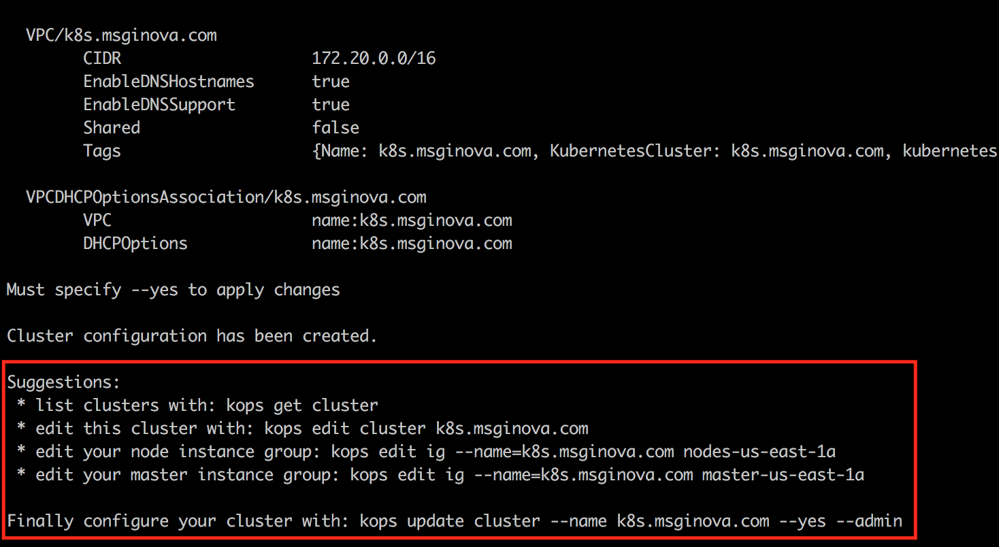
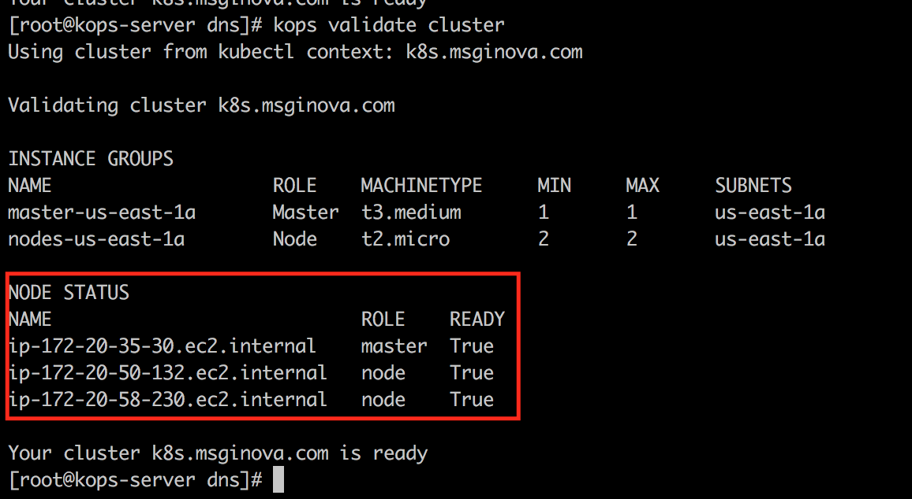

# Cluster Kubernetes AWS 

  - [1) Preparando Host Compartilhado](#1-preparando-host-compartilhado)
    - [1.1) Instância EC2 com Kops](#11-inst%C3%A2ncia-ec2-com-kops)
    - [1.2) Previlégios Necessários](#12-previl%C3%A9gios-necess%C3%A1rios)
    - [1.3) Criando Roles](#13-criando-roles)
    - [1.4) Instalando AWS Client](#14-instalando-aws-client)
    - [1.5) Instalando Kubectl](#15-instalando-kubectl)
    - [1.6) Instalando Kops](#16-instalando-kops)
    - [1.7) Par de Chaves](#17-par-de-chaves)            
  - [2) Route53](#2-route53)
    - [2.1) Configurar DNS](#21-configurar-dns)                  
    - [2.2) DNS Sub-Domínios](#22-dns-sub-dom%C3%ADnios)
    - [2.3) Configurando Sub-Domínios](#23-configurando-sub-dom%C3%ADnios)
  - [3) Buckets S3](#3-buckets-s3)
    - [3.1) Criando um Bucket](#31-criando-um-bucket) 
  - [4) Kops Provisionando Cluster](#4-kops-provisionando-cluster)
    - [4.1) Criando Cluster](#41-criando-cluster)
    - [4.2) Validando Cluster](#42-criando-cluster)
  - [5) Manipulando Orquestrador](#5-manipulando-orquestrador)
    - [5.1) Aumentando Quantidade de Workers](#5.1-aumentando-quantidade-de-workers)
  - [6) Deploy Aplicação](#6-deploy-aplicação)  
      - [6.1) Primeiro Deployment](#61-primeiro-deployment)
        - [6.1.1) Aplicando Manifestos](#611-aplicando-manifestos)
      - [6.2) Expondo Aplicação ](#62-expondo-aplicação)
        - [6.2.1) LoadBalancer](#621-loadbalancer)
          - [6.2.1.1) LoadBalancer AWS](#6211-loadbalancer-aws) 
          - [6.2.1.2) Criando DNS](#6212-criando-dns)
        - [6.2.2) Ingress Controller](#622-ingress-controller)
          - [6.2.2.1) Removendo Todos LoadBalancer](#6221-removendo-todos-loadbalancer)
          - [6.2.2.2) Ingress Controller AWS](#6222-ingress-controller-aws) 
          - [6.2.2.3) Criando DNS](#6223-criando-dns)
  - [7) Destruindo o Cluster](#7-destruindo-o-cluster)

## 1) Preparando Host Compartilhado

  Nesse documento estarei assumindo que teremos uma máquina dentro da **AWS** compartilhada, essa máquina será a responsável por gerenciar o **KOPS**. Isso nos permitirá um controle mais granular de quem realmente manipulará o kops.

### 1.1) Instância EC2 com Kops
  
  Essa máquina compartilhada é apenas um provisionador, não há necessidade dessa instância EC2 ter um hardware performático. Nessa documentação foi utilizado as seguintes configurações:

```ruby
tipo: t2.micro 
s.o : awslinux
cpu : 1
mem : 1
```


### 1.2) Previlégios Necessários

  Para que o kops possa interagir com os serviços da **AWS**, será necessário conceder previlégios. Nada impede de possuir uma conta de usuário *IAM* e especificar dentro da máquina **KOPS** as credencias necessárias ( **AWS Access Key ID** / **AWS Secret Access Key** ).
  
  Nessa documentação iremos adotar uma outra abordagem, vamos criar uma **ROLE** e anexar essa role na instância.

### 1.3) Criando Roles

  No painel esquerdo localize o menu **Funções**


  Selecione a opção EC2


  Aplique todas as permissões abaixo na Role.


  No menu de buscas, localize sua instâncias, mais precisamente a **EC2** que está rodando o **kops-manager**. Após localiza-la, vamos atribui-la a essa função recém criada.


  Vincule as permissões recém criadas na instância desejada.


### 1.4) Instalando AWS Client

  Conecte na instância via SSH para podermos prepara-la. Após conectar vire root.


```bash
[root@kops-server ~]# mkdir -p /opt/sources
[root@kops-server ~]# curl -fsSL -o /opt/sources/awscli-bundle.zip https://s3.amazonaws.com/aws-cli/awscli-bundle.zip
[root@kops-server ~]# yum update && yum install unzip python -y
[root@kops-server ~]# cd /opt/sources && unzip -q awscli-bundle.zip && cd awscli-bundle && ./install -i /opt/apps/aws -b /opt/apps/aws/bin
[root@kops-server ~]#  echo "/opt/apps/aws/lib/python2.7" > /etc/ld.so.conf.d/aws.conf && ldconfig
[root@kops-server ~]# aws ls
```

Uma vez instalado, agora é necessário configurar a instância para interagir com AWS.

*OBS.:* Os campos **AWS Access Key ID** e **AWS Secret Access Key** não devem ser preenchido, pois já fizemos o vínculo em um passo anterior.

```bash
[root@kops-server ~]# aws configure
AWS Access Key ID [None]:
AWS Secret Access Key [None]:
Default region name [None]: us-east-1
Default output format [json]: json
```

### 1.5) Instalando Kubectl

```bash
[root@kops-server ~]# curl -fsSL -o /opt/sources/kubectl https://storage.googleapis.com/kubernetes-release/release/$(curl -s https://storage.googleapis.com/kubernetes-release/release/stable.txt)/bin/linux/amd64/kubectl
[root@kops-server ~]# chmod +x /opt/sources/kubectl
[root@kops-server ~]# mv /opt/sources/kubectl /usr/local/bin/kubectl
[root@kops-server ~]# echo "export PATH=$PATH:/usr/local/bin/" > /etc/profile.d/kubernets.sh && source /etc/profile
[root@kops-server ~]# echo "source <(kubectl completion bash)" >> ~/.bashrc
```

### 1.6) Instalando Kops

```bash
[root@kops-server ~]# curl -fsSL -o /opt/sources/kops-linux-amd64 https://github.com/kubernetes/kops/releases/download/$(curl -s https://api.github.com/repos/kubernetes/kops/releases/latest | grep tag_name | cut -d '"' -f 4)/kops-linux-amd64
[root@kops-server ~]# chmod +x /opt/sources/kops-linux-amd64
[root@kops-server ~]# mv /opt/sources/kops-linux-amd64 /usr/local/bin/kops
```
### 1.7) Par de Chaves

```bash
[root@kops-server ~]# ssh-keygen
Generating public/private rsa key pair.
Enter file in which to save the key (/root/.ssh/id_rsa):
Created directory '/root/.ssh'.
Enter passphrase (empty for no passphrase):
Enter same passphrase again:
Your identification has been saved in /root/.ssh/id_rsa.
Your public key has been saved in /root/.ssh/id_rsa.pub.
The key fingerprint is:
SHA256:UgIAhdy6IXxzddeh0WZCVU7YGPDxcMF797CiRY2Zi/RA root@kops-server
The key's randomart image is:
+---[RSA 2048]----+
|&@@OB.           |
|=OoE X           |
|..= @ * .        |
| o @ o =         |
|. = * = S        |
|   . + o         |
|    .            |
|                 |
|                 |
+----[SHA256]-----+
```

## 2) Route53 

  O kops é orientado por rotas baseado em nomes, por isso é interessante criar um domínio próprio antes de iniciar o cluster. A partir da versão 1.16 é possível criar um cluster usando um DNS genérico **k8s.local**.

  O melhor cenário é criar um **sub-domínio** para receber as entradas DNS. Nesse documento vou usar um domínio real chamado *msginova.com*. Não estarei usando sub-domínio pois até o momento da criação desse documento meu DNS estava sob-responsabilidade da Goddady.

  Para fazer uso do sub-domínio é necessário migrar o gerenciamento do *DNS* para *AWS*. 

### 2.1) Configurar DNS

  Para o laboratório vamos usar um **DNS Vádido** *msginova.com*. No painel AWS busque por *Route53*, depois crie uma Zona do tipo *Público*.

  

### 2.2) DNS Sub-Domínios

  Uma vez que o sub-domino estiver configurado, o layout desejado seria esse:

```yaml
Dominio Principal    => msginova.com
Sub-Dominio-K8S      => k8s.msginova.com

Cluster Produção     => production.k8s.msginova.com
Cluster Staging      => staging.k8s.msginova.com
Cluster Homologacao  => homologacao.k8s.msginova.com
```

### 2.3) Configurando Sub-Domínios

Crei uma nova *Zona* no meu cenário chamei essa zona de **k8s.msginova.com**

  

Depois de criada, copie os servidores DNS, delegado para essa nova *Zona*.

 

Aqui está um passo importante, volte na *Zona* **msginova.com** e adicione um novo registro, conforme mostra na imagem abaixo.

 

 

Após salvar vamos testar se o Sub-Domínio está respondendo.

 

## 3) Buckets S3

  Todas as configurações do cluster kubernetes gerenciado pelo kops ficam armazenados no *S3*, portanto devemos configurar esse serviço antes de iniciarmos os trabalhos com o kops.

### 3.1) Criando um Bucket

```bash
[root@kops-server ~]# export KOPS_STATE_STORE=s3://staging.k8s.msginova.com
[root@kops-server ~]# aws s3 mb $KOPS_STATE_STORE
```


## 4) Kops Provisionando Cluster

  O kops aceita vários parâmetros na hora da criação do cluster. Os valores passados foi para atender a minha necessidade, como é um ambiente de estudos utilizei o mínimo de recursos necessários.

```yaml
  Zona AWS                        => us-east-1 ( Norte da Virgínia )
  EC2 Master                      => t3.medium
  EC2 Worker                      => t2.micro
  Quantidade de Instâncias Master => 1
  Quantidade de Instâncias Worker => 2 
```

### 4.1) Criando Cluster

```bash
[root@kops-server ~]# export NAME=k8s.msginova.com
[root@kops-server ~]# kops create cluster --name=$NAME --zones=us-east-1a --master-size t3.medium --node-size t2.micro --master-count 1 --node-count=2
```



```bash
[root@kops-server ~]# kops create secret --name=$NAME sshpublickey admin -i ~/.ssh/id_rsa.pub
[root@kops-server ~]# kops update cluster $NAME --yes
```


### 4.2) Validando Cluster


```bash
[root@kops-server ~]# kops get cluster
NAME		CLOUD	ZONES
k8s.msginova.com	aws	us-east-1a
```

```bash
[root@kops-server ~]# kops export kubecfg k8s.msginova.com --admin
kops has set your kubectl context to k8s.msginova.com
```

```bash
[root@kops-server ~]# kops validate cluster
```

O processo de criação do cluster demora de 5 a 10 minutos, quando finalizar deve-se existir 3 novas instâncias EC2.


Após aguardar os 10 minutos, rode novamente o comando.



```bash
[root@kops-server ~]# kubectl get nodes
NAME                            STATUS   ROLES    AGE   VERSION
ip-172-20-35-30.ec2.internal    Ready    master   39m   v1.19.7
ip-172-20-50-132.ec2.internal   Ready    node     36m   v1.19.7
ip-172-20-58-230.ec2.internal   Ready    node     30m   v1.19.7
```


## 5) Manipulando Orquestrador

Como podemos observar temos 2 instâncias EC2 rodando como worker. 

```bash
[root@kops-server ~]# kubectl get nodes
NAME                            STATUS   ROLES    AGE   VERSION
ip-172-20-35-7.ec2.internal     Ready    master   69m   v1.19.7
ip-172-20-46-193.ec2.internal   Ready    node     65m   v1.19.7
ip-172-20-49-167.ec2.internal   Ready    node     65m   v1.19.7
```

Suponhamos que a quantidade de worker não esteja aguentando a carga de trabalho, então é necessário aumentar a quantidade de instâncias EC2 fazendo esse papel.

### 5.1) Aumentando Quantidade de Workers

Primeiramente é necessário listarmos nossa **Instance Groups**

```bash
[root@kops-server ~]# kops get cluster
NAME		CLOUD	ZONES
msginova.com	aws	us-east-1a
```

*Obd.: Pode usar o alias (ig) ao envez do nome instancegroup*

```bash
[root@kops-server ~]# kops get ig --name k8s.msginova.com
NAME			ROLE	MACHINETYPE	MIN	MAX	ZONES
master-us-east-1a	Master	t3.medium	1	1	us-east-1a
nodes-us-east-1a	Node	  t2.micro	2	2	us-east-1a
```

Vamos editar o instânce group responsável por gerir os nodes workers *nodes-us-east-1a*

```bash
[root@kops-server ~]# kops edit ig --name k8s.msginova.com nodes-us-east-1a
```
Esse comando abre um arquivo yaml 

```yaml
apiVersion: kops.k8s.io/v1alpha2
kind: InstanceGroup
metadata:
  creationTimestamp: "2021-02-21T17:30:57Z"
  labels:
    kops.k8s.io/cluster: k8s.msginova.com
  name: nodes-us-east-1a
spec:
  image: 099720109477/ubuntu/images/hvm-ssd/ubuntu-focal-20.04-amd64-server-20210119.1
  machineType: t2.micro
  maxSize: 4
  minSize: 3
  nodeLabels:
    kops.k8s.io/instancegroup: nodes-us-east-1a
  role: Node
  subnets:
  - us-east-1a
```

```bash
[root@kops-server ~]# kops update cluster --name k8s.msginova.com --yes
I0221 18:51:18.027040    4548 executor.go:111] Tasks: 0 done / 79 total; 45 can run
I0221 18:51:18.356633    4548 executor.go:111] Tasks: 45 done / 79 total; 16 can run
I0221 18:51:18.520630    4548 executor.go:111] Tasks: 61 done / 79 total; 16 can run
I0221 18:51:18.793169    4548 executor.go:111] Tasks: 77 done / 79 total; 2 can run
I0221 18:51:19.065463    4548 executor.go:111] Tasks: 79 done / 79 total; 0 can run
I0221 18:51:19.065575    4548 dns.go:156] Pre-creating DNS records
I0221 18:51:19.351162    4548 update_cluster.go:313] Exporting kubecfg for cluster
kops has set your kubectl context to k8s.msginova.com
W0221 18:51:19.401363    4548 update_cluster.go:337] Exported kubecfg with no user authentication; use --admin, --user or --auth-plugin flags with `kops export kubecfg`

Cluster changes have been applied to the cloud.


Changes may require instances to restart: kops rolling-update cluster
```

```bash
[root@kops-server ~]# kops export kubecfg k8s.msginova.com --admin
kops has set your kubectl context to k8s.msginova.com
```

```bash
[root@kops-server ~]# kops rolling-update cluster --name k8s.msginova.com --yes
NAME			STATUS	NEEDUPDATE	READY	MIN	TARGET	MAX	NODES
master-us-east-1a	Ready	0		1	1	1	1	1
nodes-us-east-1a	Ready	0		3	3	3	4	2

No rolling-update required.
```

Após executar os procedimentos acima deve-se criar uma nova instância EC2, pois definimos que o mínimo de instância que queriamos eram 3 EC2 funcionando como worker.


```bash
[root@kops-server ~]# kubectl get nodes
NAME                            STATUS   ROLES    AGE     VERSION
ip-172-20-35-7.ec2.internal     Ready    master   85m     v1.19.7
ip-172-20-46-193.ec2.internal   Ready    node     81m     v1.19.7
ip-172-20-49-167.ec2.internal   Ready    node     81m     v1.19.7
ip-172-20-56-184.ec2.internal   Ready    node     5m21s   v1.19.7
```

## 6) Deploy Aplicação

Com o cluster *OnLine*, vamos subir o primeiro deployment.

### 6.1) Primeiro Deployment

Nesse momento o cluster já está disponível, vamos subir um pod apenas para validar se tudo está funcionando conforme o esperado. 

### 6.1.1) Aplicando Manifestos

Criar o aquivo **nginx-deployment.yaml** com o seguinte conteúdo.

```yaml
kind: Deployment
apiVersion: apps/v1
metadata:
  name: nginx
  namespace: default
spec:
  replicas: 1
  selector:
    matchLabels:
      app: nginx

  template:
    metadata:
      labels:
        app: nginx
    spec:
      containers:
      - name: nginx
        image: nginx:1.15
        ports:
        - containerPort: 80
```

Aplicando os manifestos

```bash
[root@kops-server ~]# kubectl  apply -f nginx-deployment.yaml
pod/nginx created
```

Checando se o POD subiu

```bash
[root@kops-server ~]# kubectl get pods
NAME                     READY   STATUS    RESTARTS   AGE
nginx-698676d7f8-z25rs   1/1     Running   0          7m39s
```

Como ainda não criamos nenhum serviço, não há possibilidades de consumir o serviço para testarmos. Para resolver esse impasse, conecte-se no POD no modo interativo ( bash ), onde você ganhará um terminal.

```bash
[root@kops-server ~]# kubectl exec -it nginx-698676d7f8-z25rs -n default -- bash
```

Instale o curl ... 

```bash
root@nginx-698676d7f8-z25rs:/# apt update && apt install curl -y
Ign:1 http://deb.debian.org/debian stretch InRelease
Get:2 http://deb.debian.org/debian stretch-updates InRelease [93.6 kB]
...
...
```

Testando Aplicação ...

```bash
root@nginx-698676d7f8-z25rs:/# curl localhost:80
<!DOCTYPE html>
<html>
<head>
<title>Welcome to nginx!</title>
<style>
    body {
        width: 35em;
        margin: 0 auto;
        font-family: Tahoma, Verdana, Arial, sans-serif;
    }
</style>
</head>
<body>
<h1>Welcome to nginx!</h1>
<p>If you see this page, the nginx web server is successfully installed and
working. Further configuration is required.</p>

<p>For online documentation and support please refer to
<a href="http://nginx.org/">nginx.org</a>.<br/>
Commercial support is available at
<a href="http://nginx.com/">nginx.com</a>.</p>

<p><em>Thank you for using nginx.</em></p>
</body>
</html>
```

### 6.2) Expondo Aplicação

Até o momento o serviço está rodando mas apenas localmente, precisamos nesse momento expor o serviço para o mundo exterior para disponibilizar externamente. Para isso precisaremos criar LoadBalancer para fazer essa ponte. Se observarmos não temos nenhum L.B cadastrado em nosso cluster.


### 6.2.1) LoadBalancer

Usando o tipo de service *LoadBalancer*, cada pod que precise ser disponibilizado para internet terá um servico gerenciado pela própria AWS que fará essa ponte entre o *POD* e o serviço criado dinamicamente pela AWS LoadBalancer. 

Vale ressaltar que nessa modalidade se tivermos *10 POD rodando*, teremos *10 LoadBalancer criado*. Isso pode onerar o negócio.

### 6.2.1.1) LoadBalancer AWS

Vamos criar um service que fará essa ponte entre o Pod que roda a aplicação e o mundo exterior. Vamos criar o aquivo **nginx-service-loadbalancer-aws.yaml** com o seguinte conteúdo.

*Obs.:*  **Nas especificações do service (spec) deve-se atentar que o seletor que no caso é (nginx) deve fazer match ( ser idêntico ) ao matchLabels declarado no deployment, feito no passo anterior.**

```yaml
kind: Service
apiVersion: v1

metadata:
  name: nginx-elb
  namespace: default
  annotations:
    service.beta.kubernetes.io/aws-load-balancer-type: "nlb"

spec:
  type: LoadBalancer
  selector:
    app: nginx
  ports:
    - name: http
      port: 80
      targetPort: 80
```

Aplicando o manifesto ...

```bash
[root@kops-server ~]# kubectl  apply -f nginx-service-loadbalancer-aws.yaml
pod/nginx created
```


Esse endereço é provisionado dinâmicamente pelo LoadBalancer do AWS.


### 6.2.1.2) Criando DNS

Apesar da aplicação está disponível na internet, esse DNS não ficou muito amigável para dipoonibilizá-lo para os usuários consumirem a aplicação. Para contornar isso vamos adicionar uma entrada no DNS ( Route53 ).


Após adicionar a entrada DNS podemos chamar a aplicação por um nome mais agradável.


### 6.2) Acesso Externo via Ingress Controller

Usando o service do tipo *Ingress* teremos apenas um LoadBalancer, esse serviço encaminhará as requisiçoes para *Ingress Controller* que por sua vez que comunicará com os *Services* e esse sim se comunicará com os PODs.

```yaml
L.B => Ingress Controller => Services ClusterIP => POD
```

### 6.2.2) Ingress Controller

Usando a modalidade *Ingress Controller*, para expor as aplicações temos alumas vantagens.
- Diminuimos a complexidade, pois teremos apenas um LoadBalancer para nos preucupar.
- Teremos uma enconomia pois reduzimos o numero de LoadBalancer para 1.

Vale ressaltar que nessa modalidade se tivermos *10 POD rodando*, teremos apenas *1 LoadBalancer criado*. Isso pode ser bom para o negócio.

### 6.2.2.1) Removendo Todos LoadBalancer

2 Pods Rodando ...

```bash
[root@kops-server manifestos]# kubectl  get pods
NAME                      READY   STATUS    RESTARTS   AGE
nginx-698676d7f8-m7tnk    1/1     Running   0          22m
nginx2-6889c4bbc4-5dntg   1/1     Running   0          5m54s
```

2 Services Rodando ...

```bash
[root@kops-server manifestos]# kubectl  get svc
NAME         TYPE           CLUSTER-IP       EXTERNAL-IP                                                                     PORT(S)        AGE
kubernetes   ClusterIP      100.64.0.1       <none>                                                                          443/TCP        3h4m
nginx-elb    LoadBalancer   100.66.168.195   a54d8549f030749649f4ef9cb88025c8-bdf2a1df15db5a09.elb.us-east-1.amazonaws.com   80:32259/TCP   8m21s
nginx2-elb   LoadBalancer   100.65.98.191    ae9a7ca820fe645548757af7d1dc6e5d-1023ad4e8db679f1.elb.us-east-1.amazonaws.com   80:30533/TCP   5m54s
```

Deletando os services antigos ...

```bash
[root@kops-server manifestos]# kubectl  delete svc nginx-elb
service "nginx-elb" deleted
```

```bash
[root@kops-server manifestos]# kubectl  delete svc nginx2-elb
service "nginx2-elb" deleted
```

### 6.2.2.2) Ingress Controller AWS 
### 6.2.2.3) Criando DNS

## 7) Destruindo o Cluster

Por fim, podemos destruir o cluster após aprendermos sobre o kops.

```bash
[root@kops-server manifestos]# kops get cluster
NAME		CLOUD	ZONES
msginova.com	aws	us-east-1a
```

```bash
[root@kops-server manifestos]# kops delete cluster k8s.msginova.com --yes
TYPE			NAME									ID
autoscaling-config	master-us-east-1a.masters.k8s.msginova.com					lt-04aa39151d77832bc
autoscaling-config	nodes-us-east-1a.k8s.msginova.com						lt-059c233dfb339f066
autoscaling-group	master-us-east-1a.masters.k8s.msginova.com					master-us-east-1a.masters.k8s.msginova.com
...
...
...
```


Esse comando limpa todos os serviços, EC2, Security Groups, LoadBalancer, Route53. Enfim, esse comando deve ser executado com cautela.